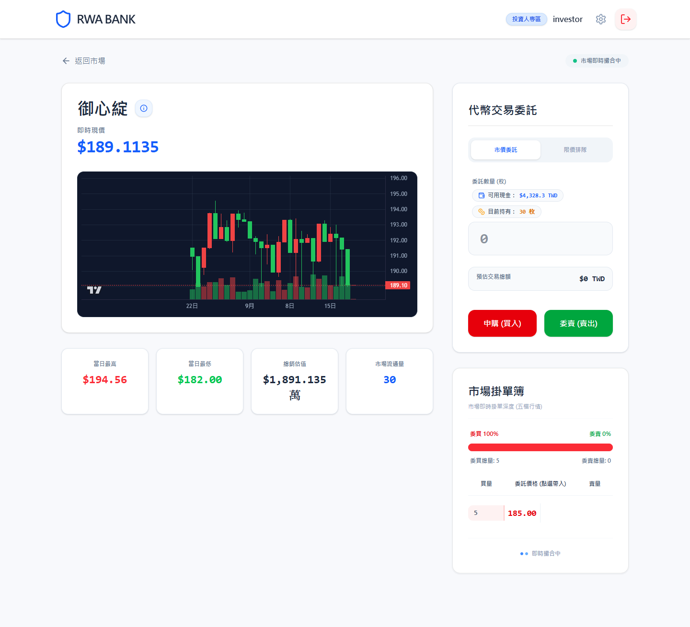
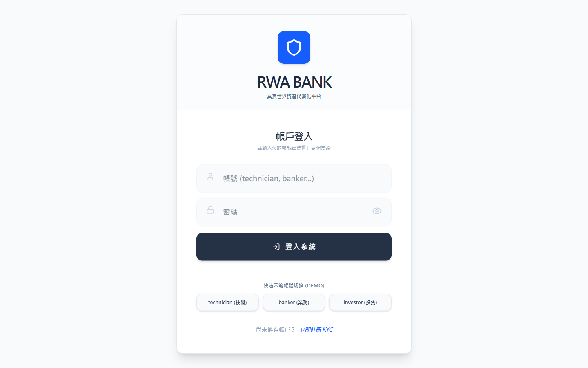
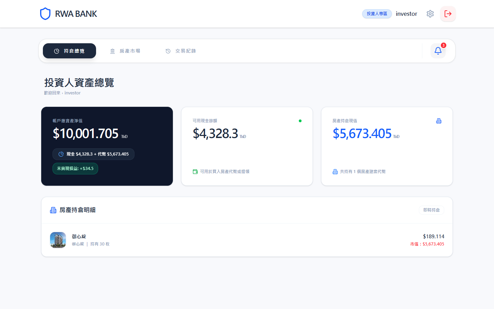
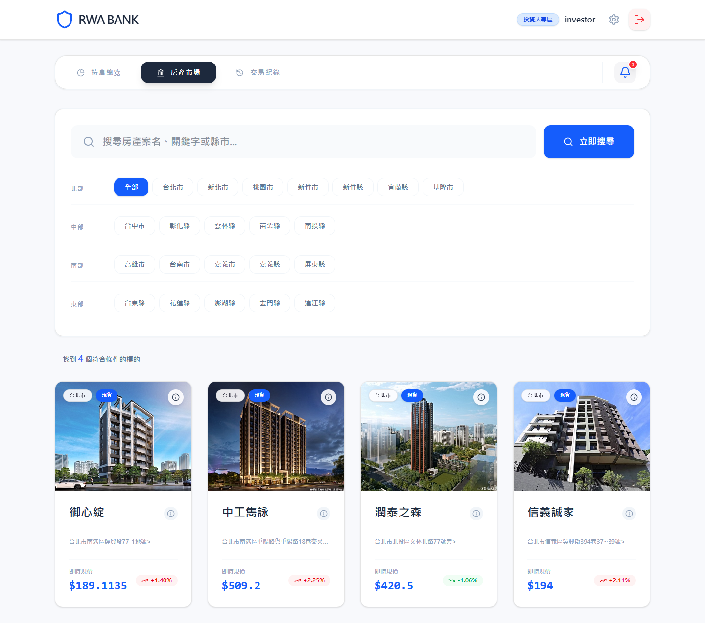
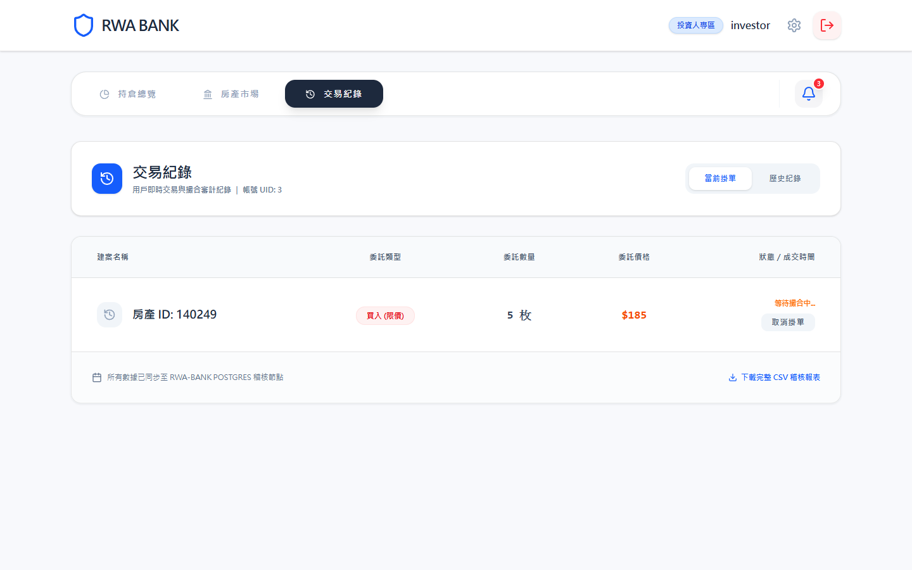
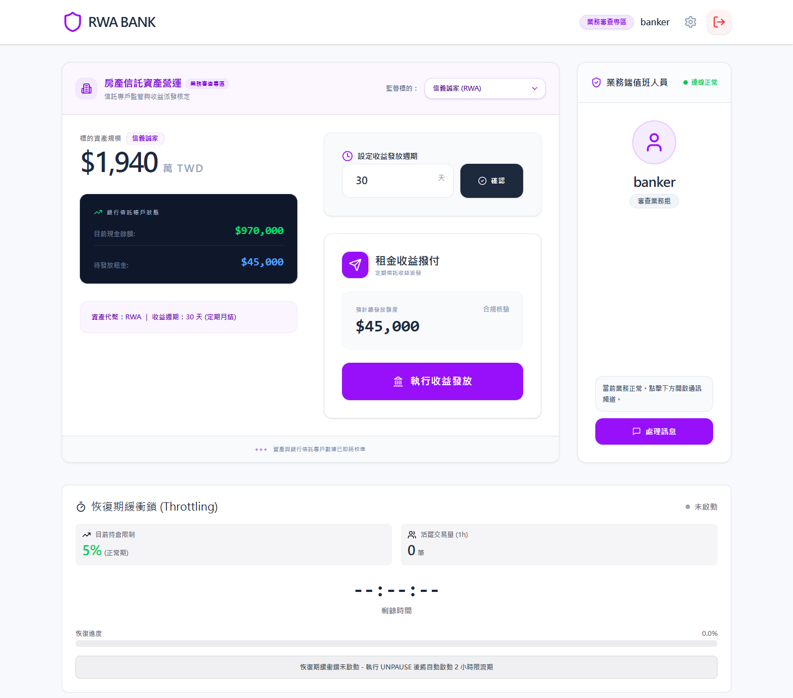
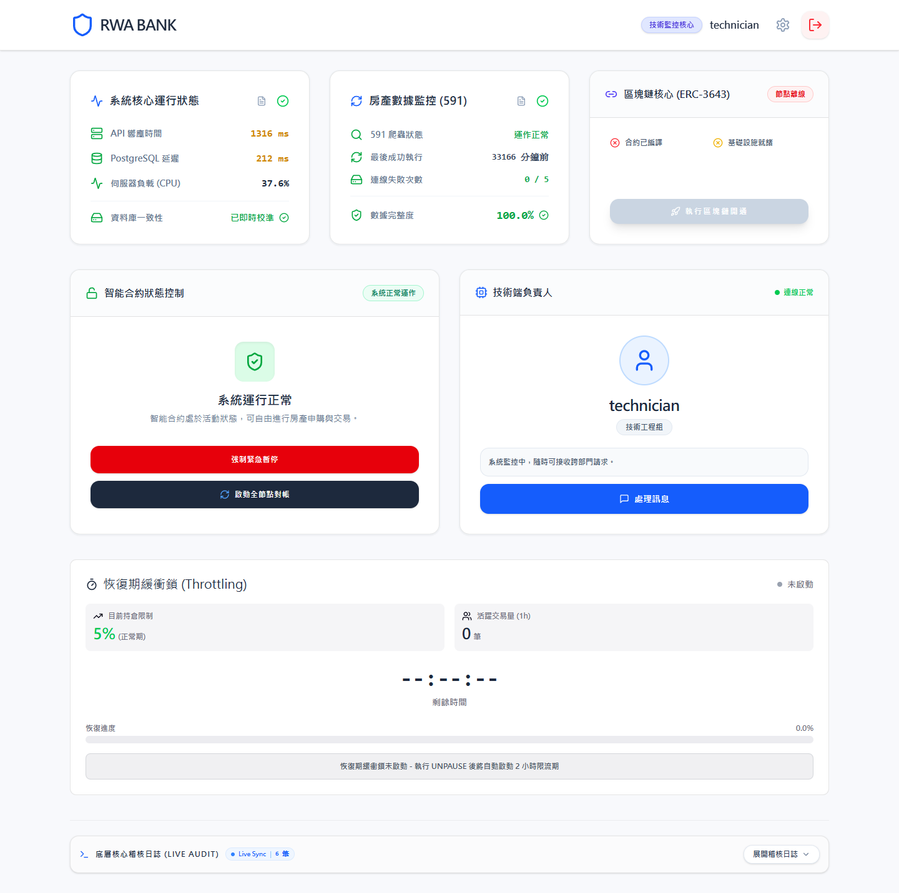

# 房產鏈金術 — RWA 不動產代幣化交易平台

> Real World Asset (RWA) tokenization platform：將台灣不動產租金收益權代幣化，
> 提供 KYC 審核、鏈上發行、限價／市價撮合、租金分潤與鏈上／鏈下自動對帳的完整流程。

**作者：[IvanWu0911](https://github.com/IvanWu0911)**



---

## 專案架構

```
.
├── RWA_Project-main/            # 核心系統
│   ├── rwa-backend/             #   NestJS 後端 API（撮合、KYC、分潤、對帳）
│   ├── blockchain/              #   Hardhat + Solidity（ERC-3643 合規代幣）
│   ├── test-logs/               #   自動化測試報告與原始 log
│   ├── docker-compose.yml       #   本機 PostgreSQL
│   └── init-db.sql
├── 412630567-RWA-DEMO-main/     # 前端 DEMO（React + Vite）
│   ├── src/app/pages/           #   投資人 / 銀行端 / 技術端 三種角色介面
│   └── crawler/                 #   Python 爬蟲：抓取台灣實價登錄資料
├── docs/                        # 專題文件書（PDF / DOCX，95 頁）與系統截圖
├── slides/                      # 簡報產生腳本（pptxgenjs）
└── export_code.js 等            # 程式碼匯出／整理工具
```

## 技術棧

| 層級 | 技術 |
|---|---|
| 前端 | React 18、Vite、TypeScript、Radix UI / shadcn、MUI、lightweight-charts（K 線） |
| 後端 | NestJS 11、TypeORM、Passport-JWT、Throttler、Schedule |
| 資料庫 | PostgreSQL 15（本機 Docker）／ Supabase（雲端） |
| 區塊鏈 | Hardhat、Solidity、ethers.js、ERC-3643 合規代幣標準 |
| 爬蟲 | Python、Playwright、psycopg2 |
| 測試 | Jest（單元／e2e／故障注入）、Hardhat test |

## 主要功能

- **三種角色**：投資人（下單、持倉、交易紀錄、CSV 稽核匯出）、銀行端（KYC 審核、租金監管、多物件分潤）、技術端（合約部署、Oracle 監控、系統健康度、鏈上對帳）
- **撮合引擎**：限價／市價單、滑價計算、台灣 K 線紅漲綠跌慣例
- **合規代幣**：ERC-3643 身分註冊與轉帳限制，僅通過 KYC 的錢包可持有
- **租金分潤**：依 `payout_cycle_days` 週期分配，含重複發放鎖定與合規週期警示
- **鏈上／鏈下對帳**：`reconcile()` 以 `queryFilter` 全量重建，偵測未追蹤轉帳與 reorg
- **故障注入測試**：服務重啟、重複事件、Nonce 衝突、區塊重組、通知失敗五情境（見 `test-logs/`）

## 系統畫面

### 投資人端

| 登入頁（三種示範角色） | 持倉總覽 |
|---|---|
|  |  |

| 房產市場（縣市篩選、即時現價） | 交易紀錄（掛單 / 歷史 / CSV 稽核匯出） |
|---|---|
|  |  |

### 業務端 — 租金監管與收益發放



### 技術端 — 系統監控與合約控制



## 專題文件

完整的系統文件書（摘要、系統設計、ER 模型、循序圖、API 授權矩陣、負載測試、SWOT 分析等，共 95 頁）：

- 📄 [房產鏈金術 RWA房產代幣化交易系統文件書.pdf](docs/房產鏈金術%20RWA房產代幣化交易系統文件書.pdf) — 可直接在 GitHub 上預覽
- 📝 [Word 原檔（.docx）](docs/房產鏈金術%20RWA房產代幣化交易系統文件書.docx)

## 快速開始

### 1. 資料庫

```bash
cd RWA_Project-main
docker compose up -d
```

### 2. 區塊鏈節點與合約

```bash
cd RWA_Project-main/blockchain
npm install
npx hardhat node          # 另開終端機
npx hardhat compile
```

### 3. 後端

```bash
cd RWA_Project-main/rwa-backend
pnpm install
# 建立 .env，至少需要：DATABASE_URL、JWT_SECRET、FRONTEND_URL
pnpm run start:dev        # http://localhost:3001
```

### 4. 前端

```bash
cd 412630567-RWA-DEMO-main
npm install
npm run dev               # http://localhost:5173
```

### 5. 爬蟲（選用）

```bash
cd 412630567-RWA-DEMO-main/crawler
pip install -r requirements.txt
playwright install
# 建立 .env，設定 DATABASE_URL
python main.py
```

## 測試

```bash
cd RWA_Project-main/rwa-backend
pnpm run test             # 單元／故障注入
pnpm run test:e2e         # 整合／權限

cd ../blockchain
npm test                  # 智能合約
```

完整測試計畫、結果與原始 log 見 [`RWA_Project-main/test-logs/`](RWA_Project-main/test-logs/)。

## 環境變數

本專案**不會**把 `.env` 提交進版本庫。後端啟動時若缺少 `JWT_SECRET` 會直接中止；
爬蟲缺少 `DATABASE_URL` 亦同。請依上方「快速開始」自行建立。

## 授權

Private — All rights reserved.
